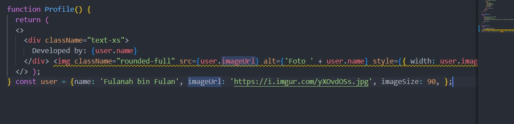

# Praktikum React - Pertemuan 01  

## Pertanyaan Praktikum 1  

1. **Jelaskan kegunaan masing-masing dari Git, VS Code, dan Node.js yang telah Anda install pada sesi praktikum ini!**  
   - **Git**: Digunakan untuk mengelola versi kode, menyimpan perubahan, dan memudahkan kolaborasi melalui GitHub.  
   - **VS Code**: Editor kode yang digunakan untuk menulis, mengedit, dan menjalankan kode dengan berbagai fitur pendukung.  
   - **Node.js**: Runtime JavaScript yang memungkinkan menjalankan kode JavaScript di luar browser, serta diperlukan untuk mengelola dependensi dalam proyek.  

2. **Buktikan dengan screenshot yang menunjukkan bahwa masing-masing tools tersebut telah berhasil terinstall di perangkat Anda!**  

     
     
     

## Pertanyaan Praktikum 2

1. **Pada Langkah ke-2, setelah membuat proyek baru menggunakan Next.js, terdapat beberapa istilah yang muncul. Jelaskan istilah tersebut, TypeScript, ESLint, Tailwind CSS, App Router, Import alias, App router, dan Turbopack!**
- **TypeScript**: Superset JavaScript dengan fitur static typing untuk kode lebih aman dan terstruktur.
- **ESLint**: Alat untuk mendeteksi dan memperbaiki kesalahan serta memastikan konsistensi kode.
- **Tailwind CSS**: Framework CSS berbasis utility untuk styling yang cepat dan efisien.
- **App Router**: Sistem routing baru di Next.js yang menggunakan pendekatan berbasis folder dalam app/.
- **Import Alias**: Fitur untuk mempermudah impor file dengan path pendek, misalnya @/components/Button.
- **Turbopack**: Bundler baru yang lebih cepat dibanding Webpack, digunakan untuk mempercepat pengembangan.

2. **Apa saja kegunaak folder dan file yang ada pada struktur proyek React yang tampil pada gambar pada tahap percobaan ke-3!**
- **src/app/** → Folder utama untuk routing dan komponen halaman.
- **page.tsx** → File utama untuk halaman default aplikasi.
- **layout.tsx** → Template layout yang digunakan di semua halaman.
- **globals.css** → File CSS global untuk styling aplikasi.
- **favicon.ico** → Ikon kecil yang muncul di tab browser.
- **.next/** → Folder build hasil kompilasi Next.js.
- **node_modules/** → Berisi dependensi proyek yang diinstal.
- **public/** → Menyimpan aset statis.
- **screenshots** → Untuk tempat menyimpan gambar

3. **Buktikan dengan screenshoot yang menunjukkan bahwa tahapan percobaan di atas telah berhasil Anda lakukan!**
    

## Pertanyaan Praktikum 3

1. **Buktikan dengan screenshoot yang menunjukkan bahwa tahapan percobaan di atas telah berhasil Anda lakukan!**
    
    

## Pertanyaa Praktikum 4

1. **Untuk apakah kegunaan sintaks user.imageUrl?**
- **user** : Sebagai Variable data dengan nama user
- **imageUrl** : Terdapat dua fungsi yaitu untuk ukuran size gambar dan untuk mengload link gambar.

2. **Buktikan dengan screenshoot yang menunjukkan bahwa tahapan percobaan di atas telah berhasil Anda lakukan!**
    
    

## Hasil Praktikum  

  

## Deskripsi  

Saya telah menyelesaikan tugas dengan menambahkan tombol **"Buka Halaman"** ke dalam `page.tsx`. Tombol ini berfungsi untuk membuka halaman di tab baru.  
